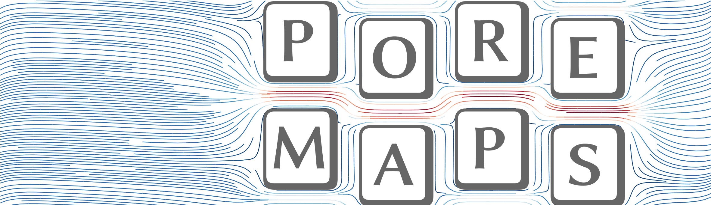

[](https://www.mib.uni-stuttgart.de/cont/)
**POREMAPS** is a Finite Difference based <ins>POR</ins>ous <ins>M</ins>edia <ins>A</ins>nisotropic <ins>P</ins>ermeability <ins>Solver</ins> for Stokes flow. 

## How to build:
We suggest to build yourself a local version of [OpenMPI](https://www.open-mpi.org/).
The code was tested with the following versions:
- Linux:
    1. `openmpi-3.1.5`
    2. `openmpi-4.1.5`
    3. `openmpi-5.0.1`
- Windows
    1. `MS-MPI v10.1.1`

Open `makefile` and edit `CLINKER` path to your `mpiCC`. The build command creates an executable `POREMAPS` in the `bin` directory. 
```shell
linux@fastmachine:~$ cd PATH/TO/POREMAPS/src/
linux@fastmachine:~$ vim makefile # edit CLINKER
linux@fastmachine:~$ make
```
To build it on MS Windows (MS Windows 10), we recommend to create a Visual Studio (v16.8.3) project from the existing code and link to the corresponding MS-MPI (v10.1.1) via the project properties. Tested setup in brackets.

## How to run
Copy the executable `POREMAPS` to the folder with input file and geometry and run by 
```shell
linux@fastmachine:~$ mylocal_mpirun -np 8 POREMAPS my_inputfile
```

Parameters in input file `input_template.inp`:
```cpp
dom_decomposition 0 0 0
boundary_method 0
geometry_file_name ptube_54_54_50_vs_2e-05.raw
size_x_y_z  54 54 50
voxel_size  2e-05
max_iter    100000001
it_eval    100
it_write   100
log_file_name permeability_ptube_54_54_50_vs_2e-05.log
solving_algorithm 2
eps 1e-06
porosity 1.0
dom_interest 0 0 0 0 0 0
write_output 1 1 0 0
```
Parameters explained:
1. **dom_decomposition**: Number of Ranks in $\mathbf{e}_1-$, $\mathbf{e}_2-$ and $\mathbf{e}_3-$ direction. If MPI should do this by itself set it to `0 0 0`.
2. **boundary_method**: Information see below.
3. **geometry_file_name**: File name of the input geometry (`.raw`-file). 
4. **size_x_y_z**: Size of the input geometry in voxel.
5. **voxel_size**: Voxel size in meter. 
6. **max_iter**: Maximum number of iterations. 
7. **it_eval**: Frequency to evaluate convergence criterion. 
8. **it_write**: Frequency to write log file.
9. **log_file_name**: Name of log file. 
10. **solving_algorithm**: Algorithm see `solver.cc` for more information. 
11. **eps**: Convergence criterion.
12. **porosity**: Porosity of the sample or domain of interest. If porosity equals -1.0 the solver computes it for the whole domain (not the effective porosity). Specify the porosity if, e.g., solid frames are used. 
13. **dom_interest**: Start and End of domain of interest for all three directions in voxel. Solver gives the permeability of this subdomain and for whole domain if set. If all entries equal 0 only permeability of the whole domain is computed. 
14. **write_output** Defines which `.raw`-file output to be written. Four entries for velocity (all three components), pressure, neighborhood and domain decomposition in that order. If 1, field is written. 


## Boundary Conditions

Choose the **boundary_method** in input file according to the requirements:

| Value | Description |
|:-----:|-------------|
| 0 | periodic in all three directions |
| 1 | periodic in direction of main pressure gradient, slip condition in the two other directions |
| 2 | periodic in direction of main pressure gradient, no-slip condition in the two other directions |
| 3 | not-periodic in direction of main pressure gradient, slip condition in the two other directions |
| 4 | not-periodic in direction of main pressure gradient, no-slip condition in the two other directions |


## Output files
The solver creates three files for the final velocity fields (`velx_*.raw`, `vely_*.raw`, `velz_*.raw`) ( $\mathbf{e}_1-$, $\mathbf{e}_2-$, $\mathbf{e}_3-$ direction ) and one for the final pressure field (`press_*.raw`). Additionaly, the determined voxel neighborhood cases (`voxel_neighborhood_*.raw`) and domain decomposition (`domain_decomp_*.raw`) are created. All files are in raw image format (`double` for all velocity and pressure files, `int` for neighborhood and domain decomposition). Using the file `fields2vtu.py` allows a direct conversion into a `*.vtu` file which can be visualized, e.g., with [ParaView](https://www.paraview.org/). All intermediate and final computational results for the permeability are included in the file `permeability_*.log`. The different entries of the `permeability_*.log` file are briefly described below:

1. **iteration**: Number of the iteration.
2. **conv**: Convergence criterion. 
3. **TPS**: Computed time steps per second. 
4. **wmax_velz**: Maximum fluid voxel velocity (`z`-component), physical dimensions. 
5. **wmean_velz**: Mean fluid voxel velocity (`z`-component), physical dimensions.
6. **k13**, **k23**, **k33**: Permeabilities in the given spatial directions. Pressure gradient and flux are computed based on the given domain of interest (see input file). If no domain of interest if given, $k_{13} = k_{23} = k_{33} = 0.0 \\, $. 
7. **wk13**, **wk23**, **wk33**: Permeabilities in the given spatial directions. Pressure gradient and flux are computed based on the whole domain.


## Compute the permeability tensor
The $z-$ or $\mathbf{e}_3-$ direction is the direction of the main pressure gradient. Rotate the domain (e.g. with `numpy.transpose()`) and rotate all results respectively to get the entries in a column. 
Example: 

original domain: **k13** -> $k_{13}$, **k23** -> $k_{23}$, **k33** -> $k_{33}$

`np.transpose(domain, (2, 0, 1))`: **k13** -> $k_{32}$, **k23** -> $k_{12}$, **k33** -> $k_{22}$

`np.transpose(domain, (1, 2, 0))`: **k13** -> $k_{21}$, **k23** -> $k_{31}$, **k33** -> $k_{11}$

## License

The solver is licensed under the terms and conditions of the GNU General
Public License (GPL) version 3 or - at your option - any later
version. The GPL can be [found online](https://www.gnu.org/licenses/gpl-3.0.en.html) or in the LICENSE.md file
provided in the topmost directory of source code tree.

## How to cite

The solver is research software and developed at research institutions. You can cite **specific releases** via [**DaRUS**](https://darus.uni-stuttgart.de)

## Developer

- [David Krach](https://www.mib.uni-stuttgart.de/institute/team/Krach/)
- [Matthias Ruf](https://www.mib.uni-stuttgart.de/institute/team/Ruf-00001/)
